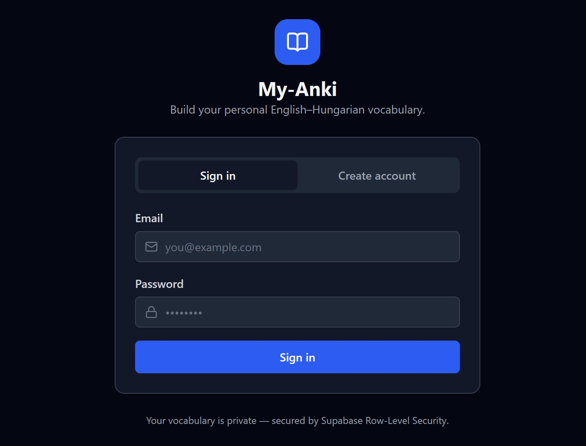
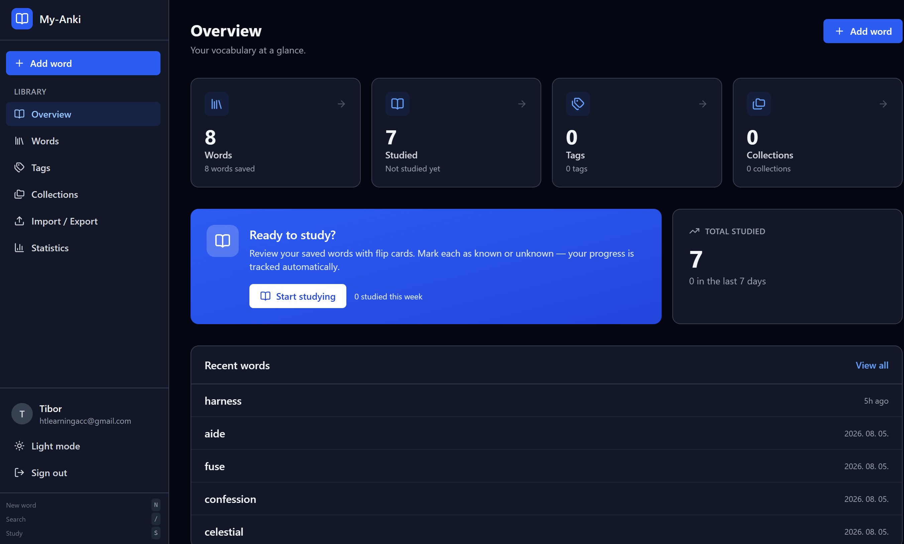
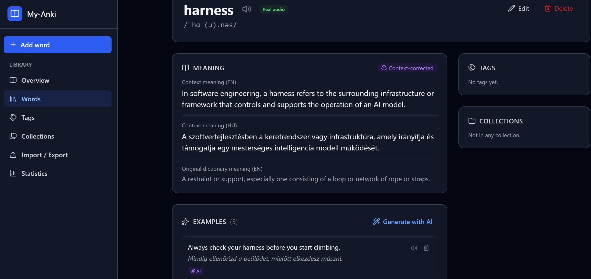

# My-Anki App

> A personal English–Hungarian vocabulary learning app that reimagines how ANKI works — with AI-powered context correction, real dictionary audio, and bilingual meanings built in.

---

## 🎯 Why this project?

Traditional ANKI is powerful but has a friction problem: you manually create every card, manually find meanings, manually write example sentences, and manually translate them. This app eliminates that friction with AI.

**The core differentiator** is AI-powered context correction. When you encounter a word in a real sentence (e.g., reading an article), you paste that sentence into the app. Gemini AI analyzes how the word is used in that specific context and generates:

- A refined meaning that fits the context (not just the generic dictionary definition)
- A Hungarian translation of that meaning
- Two new example sentences that use the word in a similar way

**Real-world example:** The word *harness* in a dictionary means "a set of straps for a horse." But in the sentence *"The team harnessed the power of data to drive growth,"* it means *kihasználni, magára ölteni* (to utilize, to leverage). The AI recognizes this contextual shift and generates the correct meaning — something a static dictionary card can never do.

---

## 🤖 How it was built

This project was built using **vibe coding** — a collaborative development process between a human and an AI assistant. The human defined the vision, requirements, and design decisions. The AI (Claude/GPT) wrote the code, debugged issues, and implemented features iteratively.

The entire project was developed conversationally: the human described what they wanted in natural language, and the AI translated that into production-ready code. No boilerplate was copy-pasted from tutorials — every line was purpose-built for this app's specific needs.

---

## 🛠️ Tech stack & rationale

| Layer | Technology | Why |
|-------|-----------|-----|
| **Framework** | SvelteKit 5 | Reactive by default with runes (`$state`, `$derived`, `$effect`). Smaller bundles than React/Vue. Server-side rendering out of the box. File-based routing that's intuitive. |
| **Styling** | Tailwind CSS v4 | CSS-first config (no JavaScript config file). `dark:` variants for dark mode. Utility classes keep the markup readable. Custom `@variant` for class-based dark mode. |
| **Backend** | Supabase | PostgreSQL + Auth + Edge Functions in one platform. Row-Level Security (RLS) means every query is scoped to the authenticated user — no manual auth checks needed. Free tier covers personal use. |
| **AI** | Google Gemini | Called via Supabase Edge Functions (Docker-based Deno runtime). The API key never touches the frontend. Dynamic model selection — the function discovers available models at runtime and tries them in order, so it survives model deprecations. |
| **Dictionary** | Free Dictionary API | No API key required. Returns IPA, audio recordings (real human pronunciation), and multiple meanings. The app falls back to TTS when no audio is available. |
| **Deploy** | Vercel | Zero-config deployment for SvelteKit. Automatic builds on every push. Edge network for global low-latency. `@sveltejs/adapter-vercel` for optimized serverless functions. |

### Why SvelteKit instead of React/Next.js?

1. **Runes are simpler than hooks** — `$state` is just a reactive variable, no `useState` + `useEffect` ceremony
2. **Smaller output** — Svelte compiles to vanilla JS; no runtime framework overhead
3. **Built-in SSR** — server-side rendering without extra configuration
4. **Form actions** — SvelteKit's form actions are a more natural pattern for mutations than React's server actions or API routes
5. **No virtual DOM** — direct DOM manipulation means faster updates and less memory

---

## ✨ Key features

### AI-powered learning
- **Context correction** — paste a sentence, AI refines the meaning for that specific context + generates Hungarian translation + example sentences
- **Example generation** — AI creates 3 bilingual example sentences per word
- **Dynamic model selection** — the Edge Functions automatically find and use available Gemini models (survives deprecations)

### Vocabulary management
- **Dictionary lookup** — search any English word, auto-fill IPA + meanings + audio
- **Real audio** — play actual human pronunciation recordings (falls back to TTS)
- **Hungarian meanings** — both manual entry and AI-generated translations
- **Tags & Collections** — organize words by topic, difficulty, or source
- **Bulk operations** — select multiple words, add/remove tags & collections, delete
- **CSV import/export** — ANKI-compatible format with Hungarian meanings

### Study mode
- **Flip cards** — 3D animated flip cards with keyboard shortcuts
- **Normal + reversed** — English→Hungarian (default) or Hungarian→English
- **Progress tracking** — known/unknown counters, streaks, last studied
- **Session summary** — review what you knew vs. what needs work

### Analytics
- **GitHub-style heatmap** — 365-day study activity calendar
- **Vocabulary growth chart** — cumulative words over time (SVG)
- **Streak tracking** — current streak + longest streak
- **Daily breakdown** — last 7 days activity bars

### UX polish
- **Dark mode** — system preference + manual toggle, smooth transitions
- **Loading skeletons** — pulse-animated placeholders (no layout shift)
- **Toast notifications** — global, non-blocking feedback
- **Keyboard shortcuts** — `N` (new word), `/` (search), `S` (study)
- **Responsive** — works on desktop, tablet, and mobile
- **Multi-language** — all UI text in English, meanings in English + Hungarian

---

## 📝 Development notes

- **Status:** In active development — features are being refined
- **Built with:** Vibe coding (human + AI collaboration)
- **License:** Personal use

---

> This is a showcase repository. The complete source code, commit history, and development documentation are in a private repository: [htlearningacc](https://github.com/htlearningacc/).
